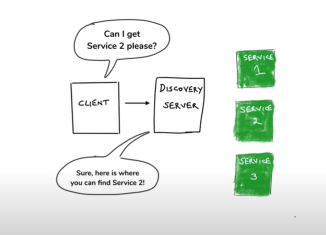
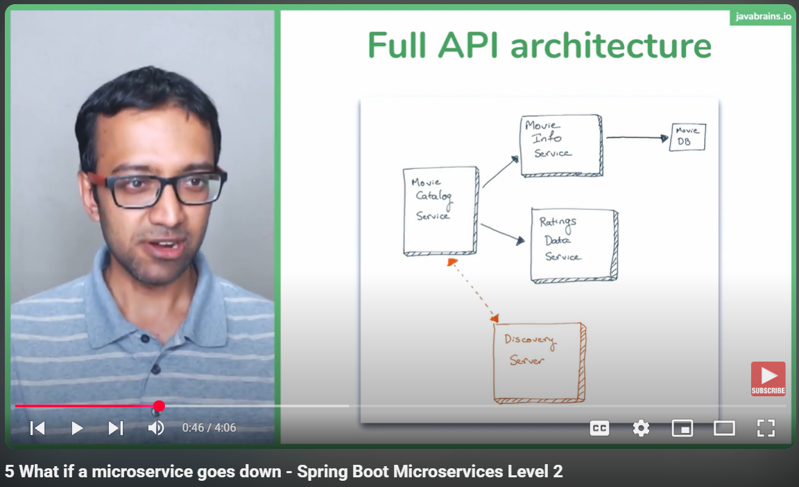
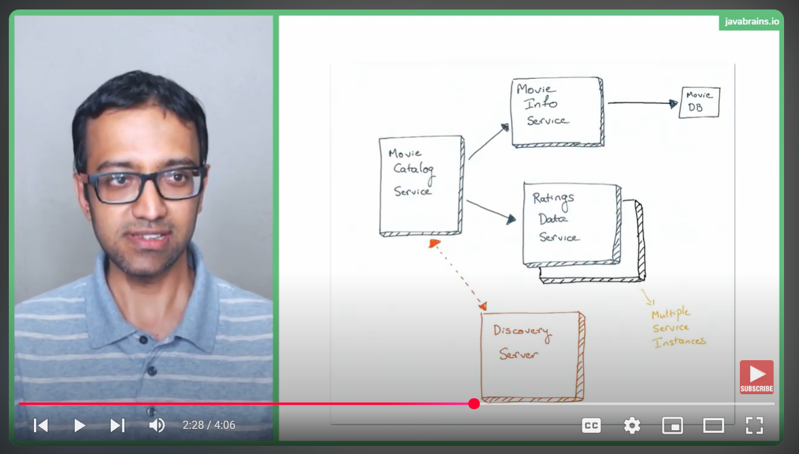
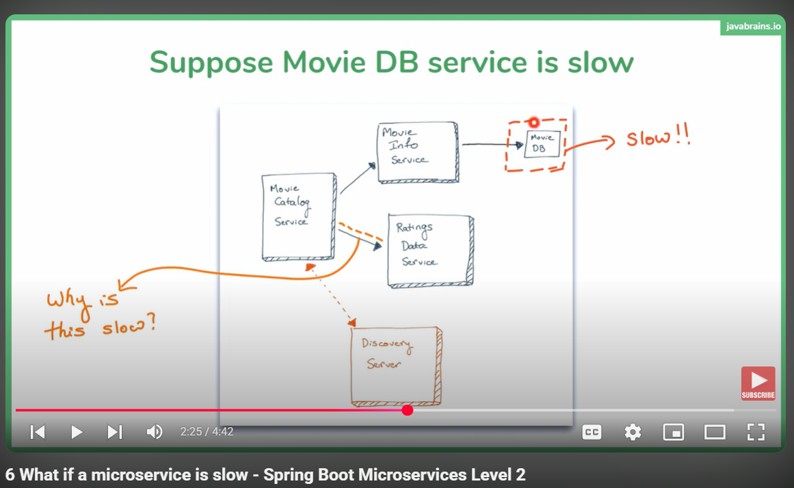
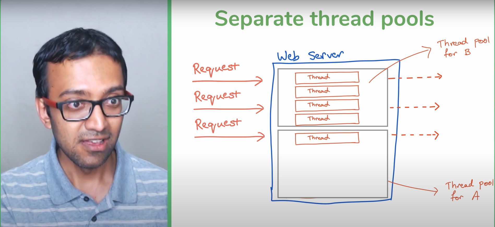

# 📘 Spring Boot Microservices Level 1 - Agenda Overview

**Video**: [Spring Boot Microservices Level 1 - Agenda](https://www.youtube.com/watch?v=y8IQb4ofjDo&list=PLqq-6Pq4lTTZSKAFG6aCDVDP86Qx4lNas)  
**Channel**: Java Brains  
**Focus**: Microservices architecture with Spring Boot — structure, communication, and discovery.

---

## 🔹 What This Course Covers

- **Building a Microservices App from Scratch**
  - Start with simple Java Spring Boot services.
  - Gradually layer in real-world communication techniques.
  - Emphasis on practical workflow and clean architecture.

- **Key Concepts Introduced**
  - Service separation and independent deployability.
  - API communication between services using `RestTemplate` and `WebClient`.
  - Dynamic service discovery via **Eureka Server**.
  - Load balancing and fault tolerance (later levels introduce Hystrix and resilience tools).

---

## 🛠️ Technologies & Tools Used

- **Spring Boot**: Core framework for microservices.
- **RestTemplate / WebClient**: To manage API calls between services.
- **Eureka**: Service registry for dynamic discovery.
- **Spring Cloud**: (Introduced later) for enhancements like configuration and load balancing.

---

## 🧱 Architecture Blueprint

The project builds:
- **Three core services**: Catalog, Info, Ratings.
- Each handles a distinct domain responsibility.
- Services communicate to aggregate data for the client-facing API.

---

## 🧩 Skills You’ll Practice

- Breaking a monolithic app into smaller services.
- Designing APIs for inter-service communication.
- Centralized service registration and discovery.
- Applying best practices for microservice structuring.

---

## 🔍 Best Practices Mentioned (Later Explored)

- Avoid hardcoding service URLs — use Eureka instead.
- Prevent tight coupling between services with clean APIs.
- Prefer `WebClient` over `RestTemplate` for non-blocking calls.

---

## 📝 Mini Summary

This course walks you through building a real-world microservices system step by step. The agenda frames core concepts you'll explore: service communication, smart discovery via Eureka, and scaling services independently. It's highly practical — ideal for devs transitioning from monoliths or diving into Spring Boot microservices for the first time.

---

# 📘 Spring Boot Microservices: Why So Many Technologies?

**Video:** [Java Brains – Why So Many Technologies](https://www.youtube.com/watch?v=cZ7tUuHjiQM&list=PLqq-6Pq4lTTZSKAFG6aCDVDP86Qx4lNas&index=2)  
**Duration:** 3:04  
**Topic:** Understanding the tech landscape in microservice architecture

---

## 🧩 Core Insight

Microservices introduce complexity by splitting a large application into smaller, independent components. These components need infrastructure and tools to support their behavior.

---

## 🛠️ Reasons for Many Technologies

- Microservices are **independent** units — they don’t exist in isolation and must interact with others
- Each one needs to:
  - Communicate with other services
  - Locate other services dynamically
  - Be configured separately
  - Be monitored and logged effectively
- These different responsibilities require **different technologies**

---

## 📌 Key Message

There isn’t one single tool that solves everything. That’s why the world of microservices feels tool-heavy — you’ll encounter many technologies, but each plays a specific role in making the architecture work.

---

## 🔄 Implication for Developers

Expect to learn multiple tools across domains like communication, discovery, configuration, and observability. The series will introduce each one as it becomes relevant during development.

# 📽️ Microservices vs Service Oriented Architecture (SOA) 

## 🔍 Overview  
The video explores the nuanced differences between Microservices and Service-Oriented Architecture (SOA), debunking the myth that microservices are simply "SOA done right."

---

## 🧱 Architectural Comparison  

### 👨‍🔧 Service-Oriented Architecture (SOA)  
- Focuses on **reusability** of services across the organization  
- Often uses **Enterprise Service Bus (ESB)** for communication  
- Emphasizes **shared infrastructure** and centralized governance  
- Can grow into **monolithic integration points** due to ESB bottlenecks  

### 🧩 Microservices  
- Prioritizes **independent deployment and scalability**  
- Leverages **lightweight communication**, usually via REST APIs  
- Promotes **domain-driven design (DDD)** — each microservice owns a specific business capability  
- Encourages **polyglot persistence & tech stacks**, allowing teams freedom  

---

## 🚧 Common Misunderstanding  
> "Microservices are just small SOA services" — not true.  
The **intent**, **design philosophy**, and **communication patterns** are fundamentally different.

---

## 🗂️ Key Design Principles of Microservices  
- **Bounded Context:** Each service should encapsulate a specific domain  
- **Loose Coupling:** Services should interact through well-defined APIs without tight dependencies  
- **High Cohesion:** Functionality within a service should be tightly related  
- **Decentralized Governance:** Teams can choose tools, languages, and databases independently  

---

## ✅ Best Practices Highlighted  
- Avoid central ESBs; instead, favor **smart endpoints and dumb pipes**  
- Design around business capabilities, not technical layers  
- Maintain **independence** in deployment and scaling — critical for agility  
- Enable teams to **own their services end-to-end**, including infrastructure, CI/CD, and monitoring  

---

## 🧠 TL;DR  
Microservices diverge from SOA by embracing independence, decentralized design, and agility. Rather than simply repackaging SOA into smaller parts, microservices rethink the architecture to align with modern deployment models and organizational autonomy.

---

# 🎬 Episode 04 — Overview of the Microservices App

## 📌 Context
This video offers a **quick overview** of the application we'll build during the workshop. The focus is on its **microservices structure** and the kind of interaction expected between components.

---

## 🧩 Application Structure
The system simulates a movie catalog app and consists of **three microservices**:

### 1. 📄 Movie Info Service
- Provides information about movies: title, description, etc.

### 2. ⭐ Movie Ratings Service
- Stores ratings provided by individual users.

### 3. 📚 Movie Catalog Service
- Queries both the Info and Ratings services.
- Combines data to present a unified response per movie and user.

---

## 🔗 Service Interaction
- Services communicate via **REST calls**.
- Each service is separate and independently deployable.

---

## 🚀 Microservice Principles Introduced
- **Single Responsibility**: Each service handles one concern.
- **Independent Deployment**: Services are built and managed separately.
- **Data Aggregation**: Catalog service stitches together info and ratings.

---

Sure thing, Eidan — here’s the complete `.md` file version of the notes for **Video 5: Designing the Sample Microservices** from the Spring Boot Microservices Level 1 course. This version reflects **only what the instructor covered**, respecting the distinction that the services are still **starter projects**, not microservices yet.

---

# 🎯 Designing the Sample Microservices 
🔖 Status: Introductory setup — no microservices yet

---

## 📌 Session Focus  
Establish the foundation for the Movie Catalog App by creating three **separate Spring Boot projects**.  
These projects represent core logical modules but are **not microservices yet** — no communication or independent deployment implemented.

---

## 📦 Projects Introduced

### 🎬 Movie Info Service  
- Purpose: Store basic movie metadata (name, description)  
- Will eventually expose APIs to provide movie details  
- Initial structure created via Spring Initializr  

### ⭐ Ratings Data Service  
- Purpose: Manage user ratings associated with movies  
- Separate project intended to return rating objects keyed by movie ID  
- No external dependencies configured at this stage  

### 📂 Movie Catalog Service  
- Purpose: Construct catalog views per user  
- Workflow design:
  - Accept a `userId`
  - Use Ratings service to get rated movies
  - Use Movie Info service to get movie details
  - Combine the two in final response structure

- Target response:
  ```json
  [
    {
      "name": "Inception",
      "description": "Mind-bending thriller by Christopher Nolan",
      "rating": 4
    },
    {
      "name": "Matrix",
      "description": "Classic sci-fi with virtual worlds",
      "rating": 5
    }
  ]
  ```

---

## 🧠 Instructor Clarifications  
- These are **starter projects only**, not true microservices yet  
- Microservices qualities such as service discovery, communication, and deployment strategies will be added in later lessons  
- Each project created via [Spring Initializr](https://start.spring.io) with barebone dependencies for now

---

---

## 🔄 Next Steps (Previewed in Ending Remarks)  
- Build REST APIs for each service  
- Enable communication between them  
- Begin gradual transformation into actual microservices architecture


> # 🎯 Using RestTemplate to Call an External Microservice API  


## 📌 Session Focus  
Demonstrate how a Spring Boot service can synchronously call other microservices using Spring’s `RestTemplate`. Key takeaways:

- Instantiate and inject a `RestTemplate` bean  
- Call external REST endpoints with `getForObject` and `getForEntity`  
- Map JSON responses directly into Java POJOs  
- Handle errors and inspect full HTTP response when needed  

---

## 📦 Core Components & Code Snippet  

### 🔧 RestTemplate Configuration  
```java
@Bean
public RestTemplate restTemplate() {
    return new RestTemplate();
}
```
Inject this bean into your controller or service.

### 📝 Sample Controller  
```java
@RestController
@RequestMapping("/catalog")
public class MovieCatalogResource {

    @Autowired
    private RestTemplate restTemplate;

    @GetMapping("/{userId}")
    public List<CatalogItem> getCatalog(@PathVariable("userId") String userId){
        // 1. Get hardcoded Ratings Data
        List<Rating> ratings = Arrays.asList(
                new Rating("123", 4),
                new Rating("456", 5)
        );

        // 2. Enrich each rating by fetching movie info
        return ratings.stream()
                .map(r -> {
                    Movie movie = restTemplate.getForObject(
                            "http://localhost:8082/movies/" + r.getMovieId(),
                            Movie.class
                    );
                    return new CatalogItem(movie.getName(), movie.getDescription(), r.getRating());
                })
                .collect(Collectors.toList());
    }
}
```

---

## 🧠 Key Methods  

- `getForObject(String url, Class<T> responseType)`  
  Returns only the response body as the specified type.  

- `getForEntity(String url, Class<T> responseType)`  
  Returns `ResponseEntity<T>` with status, headers, and body.  

- Other HTTP helpers: `postForObject`, `put`, `delete`, etc.

---

Sure thing, Eidan! Based on the video "[Using WebClient to make API calls](https://www.youtube.com/watch?v=F3uJyeAyv5g&list=PLqq-6Pq4lTTZSKAFG6aCDVDP86Qx4lNas&index=13)" from the Spring Boot Microservices Level 1 series by Java Brains, here's a human-friendly technical summary in markdown format — ideal for your workshop notes or GitHub documentation:

---


> # 🧵 WebClient in Spring Boot Microservices

## 🎯 Overview
This video transitions API communication from `RestTemplate` to the newer, more powerful `WebClient`. WebClient is part of Spring WebFlux and supports **reactive programming** — a non-blocking, event-driven model that handles concurrency more efficiently.

---

## 🧪 Why Switch to WebClient?
- `RestTemplate` is blocking and synchronous.
- `WebClient` offers asynchronous, non-blocking HTTP calls.
- Ideal for high-throughput microservices communicating with other services.

---
`In WebFlux, when making an API call like webClient.get().retrieve().bodyToMono(Movie.class), it returns a Mono<Movie>, meaning the movie data will be available asynchronously when subscribed to and can be used later once available.`

## ⚙️ Setup & Usage

```java
// Create WebClient bean using builder
@Bean
public WebClient.Builder getWebClientBuilder() {
    return WebClient.builder();
}
```

```java
// Inject and use WebClient
@Autowired
private WebClient.Builder webClientBuilder;

Movie movie = webClientBuilder.build()
    .get()
    .uri("http://localhost:8082/movies/" + movieId)
    .retrieve()
    .bodyToMono(Movie.class)     // Reactive wrapper
    .block();                    // Optional: forces synchronous behavior
```

### Key Points
- `.retrieve()` starts the request.
- `.bodyToMono(Class)` expects a single object.
- `.block()` converts the call to synchronous — useful for hybrid legacy integration but not recommended for full-reactive apps.

---

## 🧠 Reactive Terminology
- `Mono<T>` → Represents a single async response.
- `Flux<T>` → Represents a stream of async responses.
- Non-blocking means threads aren't held up while waiting for a response.
---

## 🔁 Comparison with RestTemplate
| Feature        | RestTemplate   | WebClient         |
|----------------|----------------|-------------------|
| Blocking       | ✅ Yes          | ❌ No              |
| Reactive       | ❌ No           | ✅ Yes             |
| Future-Proof   | ❌ Legacy       | ✅ Preferred       |
| Thread Usage   | High            | Low (efficient)   |

---

## 🧳 Real-World Use Cases
- Ideal for microservice-to-microservice communication.
- Works well with reactive databases (R2DBC) and data streams.
- Reduces resource footprint under load — great for scalable services.

---


> # Why You Should Avoid Returning Lists in APIs

A quick dive into why wrapping JSON arrays in a top-level object leads to more robust, extensible, and client-friendly APIs.

## Mini Summary

When you expose a raw JSON array as the top-level response, you lose flexibility to add metadata, versioning info, error details or HATEOAS links later. Wrapping the array in an object preserves room for growth and better client/server contracts.


## 1. The Problem with Top-Level Arrays

- No place for pagination or total-count metadata  
- Hard to evolve your API without breaking existing clients  
- Error responses must use the same structure—leaving arrays makes this awkward  
- Some frameworks (Swagger/OpenAPI, code generators) expect a JSON object at the root


## 2. Impact on Clients and Tooling

- Client code generators can’t attach new fields  
- Inconsistent parsing rules across libraries (e.g., Jackson vs. Gson)  
- Swagger UI displays arrays differently—limits documentation clarity  
- Harder to inject HATEOAS links or custom headers in the payload  


## 3. The Wrapper Pattern

Instead of returning:
```json
[
  { "id": 1, "title": "Movie A" },
  { "id": 2, "title": "Movie B" }
]
```

Return a structured object:
```json
{
  "data": [
    { "id": 1, "title": "Movie A" },
    { "id": 2, "title": "Movie B" }
  ],
  "meta": {
    "totalItems": 2,
    "page": 1,
    "pageSize": 25
  },
  "links": {
    "self": "/movies?page=1",
    "next": "/movies?page=2"
  }
}
```

## 4. Real-World Benefits
- **Extensibility**: Add new fields (e.g., warnings, debug info) without client-side breaks
- **Consistency**: Same wrapper for success and error responses
- **Metadata**: Easily include paging, sorting, or custom metrics
- **HATEOAS friendly**: Central place to inject links for client navigation

## 5. Best Practices & Tips
- Always use proper HTTP status codes (200, 4xx, 5xx) alongside your JSON wrapper
- Standardize your wrapper across all endpoints for predictability
- Consider industry schemas (JSON:API, HAL) if you need hypermedia support
- Document your `meta` and `links` fields clearly in your API spec

> # Understanding Service Discovery (Spring Boot Microservices Level 1)
Service discovery lets microservices dynamically locate and communicate with each other without hard-coding endpoints. Instead of binding clients to fixed hostnames and ports, we introduce a registry that maintains live instances. This video contrasts the common “what are we doing wrong here” pitfall (tight coupling via hard-coded URLs) with client-side and server-side discovery approaches.

## What Are We Doing Wrong Here?

In our Movie Catalog service we called Movie Info like this:

```java
String url = "http://localhost:8081/movie-info/" + movieId;
MovieInfo info = restTemplate.getForObject(url, MovieInfo.class);
```

- Hard-codes host and port
- Couples client code to a specific instance
- Fails when you scale instances or change ports
- Requires manual updates on every deployment

That fragility and maintenance burden is exactly why we need service discovery—to decouple logical service names from physical locations.


## Two Service Discovery Approaches

### 1. Client-Side Discovery

Clients query a registry directly, pick an instance, then call it:

1. **Service Registration**  
   Each service registers under a logical name (e.g. “movie-info-service”) on startup.
2. **Lookup & Invocation**
   ```java
   @Autowired
   private DiscoveryClient discoveryClient;

   List<ServiceInstance> instances = discoveryClient.getInstances("movie-info-service");
   ServiceInstance instance = instances.get( new Random().nextInt(instances.size()) );
   String baseUrl = instance.getUri().toString();
   MovieInfo info = restTemplate.getForObject(baseUrl + "/movie-info/" + movieId, MovieInfo.class);
   ```
3. **Load Balancing**  
   Client-side logic (round-robin, random) picks which instance to call.

Pros
- No extra network hop
- Full control over load-balancing strategy

Cons
- All clients must embed discovery logic
- Registry API becomes a direct dependency

---

### 2. Server-Side Discovery

A dedicated router or proxy handles discovery for clients:

1. **Registration**  
   Services still register with a discovery server.
2. **Client Call**  
   Clients issue normal HTTP requests to a gateway (e.g. `http://gateway/movie-info/{id}`).
3. **Routing & Load-Balancing**  
   The gateway queries the registry, selects an instance, and forwards the request.

Pros
- Clients remain simple HTTP callers
- Centralized routing, easier to secure and monitor

Cons
- Adds an extra network hop
- Gateway itself needs to be highly available

---

## Key Takeaways & Best Practices

- Never hard-code hostnames or ports in client code.
- Register and deregister services automatically (on startup/shutdown).
- Leverage health checks so only healthy instances appear in the registry.
- Use client libraries (Spring Cloud Netflix, Spring Cloud Gateway) to abstract discovery logic.
- Combine discovery with resilience patterns: timeouts, retries, circuit breakers (Hystrix, Resilience4j).


### Why Hardcoded URLs are bad?
- Changes require code updates
- Dynamic URLs in the cloud -> When we deploy microservices on cloud for example Heroku, then we don't have any idea
  what would be the API URLs
- Load Balancing
- Multiple environments -> In real-world applications, it's common to deploy across multiple environments
  (e.g., development, staging, production). Hardcoding URLs makes it difficult to handle different
  environments for several reasons

So, because of all these drawbacks, we have `Service Discovery (A Pattern)` which helps microservices discover and talk to each other

### Service Discovery in Spring Cloud



Service discovery in Spring Cloud plays a crucial role in systems following a microservices architecture, as shown in the diagram. Here’s how it works:

- **Discovery Server (Registry)** : At the heart of service discovery is a discovery server, like **Eureka** (a widely-used component in Spring Cloud). This server acts as a registry where all the microservices register themselves. It's like a phonebook for services.

- **Service Registration** : Each microservice (such as **SRV 1**, **SRV 2**, and **SRV 3** in the diagram) registers its details (like hostname, port, etc.) with the discovery server. This allows other services to locate it dynamically rather than relying on hardcoded configurations.

- **Client-Side Service Discovery** : When the client (in this case, the **CLIENT** box in the diagram) needs to communicate with a specific service, it queries the discovery server to get the relevant information. This ensures flexibility and scalability, as services can be added or removed without affecting the client directly.

- **Load Balancing** : If multiple instances of a service exist (e.g., several instances of **SRV 1**), the discovery server can provide the client with all available instances. Tools like **Ribbon** (Spring Cloud Load Balancer) help to distribute requests across these instances efficiently.

- **Dynamic Updates** : The registry is updated dynamically, so if a service goes down or is brought up, the discovery server maintains an accurate and current list of available services.

Now, what happens in the above diagram for `Client Side Service Discovery`, each of those `services` which want to be discovered by the `Client`, register themselves with that `Discovery Server`.
In other words, `Service Discovery` is like a phone book guy which is maintaining a `Phone Book` and all these people are kind of
providing the entries into the phone book. Whoever needs to make a call looks up the phone book and gets the address

> Remember : Spring Cloud uses the Client Side Service Discovery

> # 📘 Eureka Service Discovery

## 🎯 What Is Eureka Server?

> Think of Eureka Server as the “address book” for microservices in Spring Cloud applications.

In a cloud-native app like an online food delivery platform, you might have:

- 🧾 **Order Service**: Places and tracks orders
- 🍽️ **Restaurant Service**: Manages menus and availability
- 🚚 **Delivery Service**: Coordinates delivery agents

Each service runs independently, but they need to **find and talk to each other dynamically**. That’s where Eureka Server comes in — instead of hardcoding IPs or URLs (which can change), services use Eureka for registration and discovery.

## 🔄 How It Works (User Insight)

- **Service Registration**  
  Each microservice registers itself with Eureka Server upon startup (hostnames, ports, metadata).

- **Service Discovery**  
  When one service wants to communicate with another, it asks Eureka for the current address — avoiding brittle, hardcoded paths.

### 🧩 Why Use Eureka?

- Microservices in cloud environments scale up/down unpredictably.
- Their network locations (host:port) often change.
- Hardcoding service addresses breaks dynamic scaling.
- Eureka maintains a **live registry** and allows **runtime service lookups**.

### 🏗 Origins & Purpose

- Eureka was built by **Netflix** to support its massive microservice architecture.
- Provides:
    - Dynamic discovery
    - Heartbeat checks
    - Resilience features like **self-preservation mode**

### ☕ Spring Boot Integration 
- Spring Cloud offers out-of-the-box support via annotations and auto-config.
- Developers can turn a plain Spring Boot app into a Eureka registry with minimal effort.
- The current video does **not** show code — it sets the stage conceptually.

> # 🚀 Starting a Eureka Server

This video walks you through creating a **Eureka Server** using Spring Boot. You’ll build a discovery service, enable Eureka, configure essential settings, and verify the dashboard — all within scope.

## 📦 Step-by-Step Guide

### 1️⃣ Create a New Spring Boot Project

- Use [Spring Initializr](https://start.spring.io)
- Add the following **dependency**:  
  `spring-cloud-starter-netflix-eureka-server`
- Set the project name as `discovery-server`

---

### 2️⃣ Enable Eureka Server

In your main class:

```java
@SpringBootApplication
@EnableEurekaServer
public class DiscoveryServiceApplication {
    public static void main(String[] args) {
        SpringApplication.run(DiscoveryServiceApplication.class, args);
    }
}
```

🧠 The annotation `@EnableEurekaServer` activates Eureka's registry logic — no controllers or REST endpoints needed.

---

### 3️⃣ Understand Default Behavior

> ⚠️ **Important note:** Every Eureka Server is also treated as a Eureka Client by default.

That means it will try to **register itself** to another registry — or to its own dashboard if no other registry exists.

---

### 4️⃣ Configure `application.properties` to Avoid Self-Registration

```properties
# Tell Eureka Server to stop acting like a client (Eureka)
eureka.client.register-with-eureka=false
eureka.client.fetch-registry=false
```

🔍 Explanation:
- `register-with-eureka: false` tells the server **not to register itself** as a client.
- `fetch-registry: false` prevents it from looking for other Eureka servers (discovery is disabled).

### 5️⃣ Launch and Verify
- Run the app locally (via IDE or terminal).
- Open: [`http://localhost:8761`](http://localhost:8761)
- You’ll see the **Eureka dashboard** — no services registered yet, which is expected.


> “Think of Eureka Server as the **receptionist** in a company.  
> Visitors (microservices) come in and write their details in the visitor log.  
> Other visitors can ask the receptionist for someone’s location — and get directed.”

># 🎥 Creating Eureka Clients
Convert three standalone microservices into Eureka-aware clients in just a few steps. After adding a single dependency and minimal configuration, each service will auto-register with your running Eureka Server and appear in the dashboard.

## 🔧 Prerequisite
- A Eureka Server up and running at `http://localhost:8761` (see Video #19).

## 🚀 Step-by-Step Guide

### 1. Add the Eureka Client Dependency

In each microservice’s `pom.xml`, include:

```xml
<dependency>
  <groupId>org.springframework.cloud</groupId>
  <artifactId>spring-cloud-starter-netflix-eureka-client</artifactId>
</dependency>

<dependencyManagement>
<dependencies>
  <dependency>
    <groupId>org.springframework.cloud</groupId>
    <artifactId>spring-cloud-dependencies</artifactId>
    <version>${spring-cloud.version}</version>
    <type>pom</type>
    <scope>import</scope>
  </dependency>
</dependencies>
</dependencyManagement>

<!-- Add this in properties tag just under java version property-->
<spring-cloud.version>Greenwich.RELEASE</spring-cloud.version>
```

This brings in the client-side service-registration and discovery hooks.


### 2. Enable Eureka Client

In your main application class, add:

```java
@SpringBootApplication
@EnableEurekaClient
public class MovieInfoServiceApplication {
  public static void main(String[] args) {
    SpringApplication.run(MovieInfoServiceApplication.class, args);
  }
}
```

- `@EnableEurekaClient` activates Eureka registration.
- Note: With the starter on the classpath, Spring Boot can also auto-detect client behavior even without this annotation.

### 3. Configure Each Service

Create or update `application.yml` (or `.properties`) in each microservice:

```yaml
spring:
  application:
    name: movie-info-service   # Unique service ID

server:
  port: 8081                  # Change per service (e.g., 8082, 8083 for others)

eureka:
  client:
    service-url:
      defaultZone: http://localhost:8761/eureka/
```

- `spring.application.name` is the identifier shown in Eureka.
- Point `defaultZone` to your Eureka Server’s `/eureka` endpoint.

---

### 4. Start & Verify Registration

1. Launch your Eureka Server (if not already running).
2. Start each microservice (`mvn spring-boot:run` or via IDE).
3. Open `http://localhost:8761` in your browser.

You should now see entries for:
- `MOVIE-INFO-SERVICE`
- `MOVIE-CATALOG-SERVICE`
- `RATING-DATA-SERVICE`

Each listed with its instance ID, status (UP), and port.

## 💡 Key Takeaways & Tips

- Ensure **unique service names** to avoid collisions in the registry.
- Verify ports before startup—Eureka won’t register two instances on the same port.
- You can omit `@EnableEurekaClient` if you prefer convention-over-configuration; the starter will pick it up.
- For production, secure your Eureka endpoints and consider timeouts/retry settings under `eureka.instance` and `eureka.client`.


```  
All set! Your microservices are now Eureka clients, ready for dynamic discovery and resilient inter-service communication.  
```

># Why Add `@LoadBalanced`

When you annotate your RestTemplate or WebClient.Builder bean with `@LoadBalanced`, Spring injects a special filter/interceptor that:

- Hooks into your discovery client (Eureka, Consul, etc.)  
- Resolves URIs of the form `http://{serviceId}/…` into actual host:port pairs  
- Applies client-side load balancing (round-robin by default) across all healthy instances  

In essence, `@LoadBalanced` turns a vanilla HTTP client into a smart, service-aware one. Calls like:
```java
restTemplate.getForObject("http://user-service/users/123", User.class);
```
no longer fail on unresolvable hostnames—they dynamically pick one of the registered `user-service` instances via the load balancer.

### Under the Hood

- For RestTemplate, Spring replaces the default `ClientHttpRequestFactory` with one backed by a `LoadBalancerClient`
- For WebClient, it registers a `ReactorLoadBalancerExchangeFilterFunction` filter behind the scenes
- Both leverage a `ServiceInstanceListSupplier` to fetch up-to-date instance lists and perform round-robin or custom load-balancing strategies

### Benefits

- No hard-coded URLs or ports—just logical service IDs
- Automatic fail-over when instances go down or auto-scale
- Seamless integration with resilience tools (Resilience4J, retries, timeouts)

**Key Takeaway:**  
Use `@LoadBalanced` whenever you want your HTTP client to be discovery-driven and distribute load across multiple service instances automatically.

> # Spring Boot Microservices Level 2: Fault Tolerance and Resilience

This introductory lecture lays out the roadmap and key prerequisites for diving into fault tolerance and resilience in Spring Boot microservices. You’ll learn which resilience patterns we’ll cover—from simple timeouts to advanced circuit breakers and bulkheads—and ensure you have the foundational Spring Cloud skills needed to continue.

## Prerequisites

- Java 8 or higher
- Spring Boot fundamentals (controllers, dependency injection, application properties)
- Completion of **Level 1: Communication and Discovery**
  - Service registration/discovery with Eureka
  - Client-side load balancing with Ribbon
  - Declarative REST clients with Feign
- Maven or Gradle build experience

## Course Agenda

1. Fault Tolerance vs Resilience
2. Recap of Level 1 (Communication & Discovery)
3. Calling an External API
4. Handling Downed Microservices
5. Dealing with Slow Microservices
6. The Problem with Threads in Blocking I/O
7. A Possible Solution for Slow Services
8. Adding Timeouts to `RestTemplate`
9. Why Timeouts Alone Aren’t Enough
10. Understanding the Circuit Breaker Pattern
11. Key Circuit Breaker Parameters
12. Designing Fallback Strategies
13. Benefits of Circuit Breakers (Plus Q&A)
14. Introduction to Hystrix
15. Integrating Hystrix into a Spring Boot App
16. Hystrix Internals: How It Works
17. Limitations of the Hystrix Proxy Approach
18. Refactoring for Granular Fallbacks
19. Tuning Hystrix Configuration Parameters
20. Monitoring with the Hystrix Dashboard
21. Implementing the Bulkhead Pattern
22. Course Summary and Next Steps

## Key Takeaways

- This level zeroes in on **making your microservices robust** under failure scenarios.
- Resilience isn’t just retries and timeouts—it’s about **design patterns** that isolate, degrade, and recover.
- You need a solid grasp of **Spring Cloud Netflix** (Eureka, Ribbon, Feign) before adding Hystrix and bulkheads.
- Each pattern builds on the last: timeouts ➔ circuit breakers ➔ bulkheads ➔ monitoring.

> # Fault Tolerance vs Resilience

This video unpacks the difference between fault tolerance and resilience in microservices. You’ll learn why resilience goes beyond just handling errors to include recovery, elasticity, and robustness. Understanding this distinction is crucial before diving into patterns like timeouts, retries, and circuit breakers.

## Definitions

- **Fault Tolerance**  
  > The system’s ability to continue functioning correctly even when some components fail. It focuses on continuity—catching and handling errors so that clients see minimal disruption.

- **Resilience**  
  > The broader capability to adapt, recover, and sustain performance under stress or unexpected conditions. Resilience encompasses fault tolerance but also includes self-healing, scalability under load, and graceful degradation.

## Key Characteristics

| Aspect               | Fault Tolerance                     | Resilience                                |
|----------------------|--------------------------------------|-------------------------------------------|
| Goal                 | Survive individual failures          | Adapt and recover under adverse scenarios |
| Scope                | Error handling and redundancy        | Architecture design and operational maturity |
| Example Techniques   | Try/catch blocks, retries, timeouts  | Circuit breakers, bulkheads, health checks |
| Outcome              | Continue serving requests            | Maintain acceptable performance and recover |

## Example Snippet (Pseudo-Code)

```java
@RestController
public class CustomerController {
    private final OrderClient orderClient;

    @GetMapping("/customer/{id}/orders")
    public List<Order> getOrders(@PathVariable String id) {
        try {
            return orderClient.fetchOrders(id);
        } catch (Exception e) {
            // Fallback for fault tolerance
            log.warn("Order service unavailable, returning empty list", e);
            return Collections.emptyList();
        }
    }
}
```

>  **Full API Architecture**
So, here's the full API Architecture so far. We have three services again but `MovieInfoService` is calling an external API, `MovieDB API`.
A slight addition we added to microservices but nothing big, nothing significant; very simple stuff.



> # 🦸‍♂️ Microservices Assemble: What If One Falls?


> **Opening Mystery:** `Is our application resilient?`

Imagine your microservices as a team of superheroes 🦸‍♀️🦸‍♂️ — each with a unique power. But what if one hero gets knocked out mid-battle?


### 🧨 The Crisis Scenario:
- You’ve built a Spring Boot app with multiple microservices.
- One day, the **Catalog Service** goes down. 💥
- Other services — like **Genre Service** or the **UI** — rely on it.
- Result? They start failing too. 😱

It’s like the team’s strategist (Catalog Service) vanishes, and the rest stumble in confusion.

---

### 🧠 The Realization:
> “We don’t want our entire application to crash just because one service is down.”

This isn’t just a bug — it’s a **resilience problem**. Your system needs to **bounce back**, not break down.

---

### 💡 Takeaway:
> “Resilience isn’t about avoiding failure — it’s about surviving it.”

Your microservices should be like seasoned heroes: ready for setbacks, trained to adapt, and built to endure.


### 🔁 Making Microservices Resilient
---

## 🤔 The Big Question

> “What can we do to make this resilient?”

Right now, we’re dealing with the **least fault-tolerant microservices setup** imaginable:
- No error handling
- No retry logic
- No service duplication
- One instance per service
- No `try-catch`, no recovery logic

In short:  
**If any service fails, the whole system crashes.**

---

## 📉 Example Breakdown

Let’s look at the **Movie Catalog Service**:
- It fetches data from `Movie Info Service`
- Then it fetches data from `Rating Service`
- It compiles both into a response

🔗 If **either of those two services** goes down,  
📉 **Movie Catalog fails** — and so does the user request.

---

## 🧱 This Is NOT Resilient

And that’s *actually great news* — because this is the perfect foundation for learning resilience.

> To make something fault-tolerant, you must first understand what makes it fragile.

---

## 💥 What Can Go Wrong in Microservices?

Here’s a real-world scenario:

### ❌ One Instance Goes Down
- Services are running as single instances.
- If one instance fails, **boom 💥 — the entire flow breaks**.

So… how do we avoid this?

---

## 🛠️ First Real Fix: **Redundancy**

### ✅ Run Multiple Instances
- Deploy more than one instance of each microservice.
- Distribute them across:
  - Different machines (best for production)
  - Or different ports on the same machine (okay for dev/testing)



> # 🐢 What If a Microservice is Slow?

## 🧠 Common Assumption

> "If a microservice is **slow**, it’s not a big deal. At least it’s not down, right?"

Turns out... that’s a **dangerous misconception**.



---

## ⚠️ Problem Scenario: The Hidden Danger

Let's visualize a chain of services:

> **Movie Catalog Service**  
  → Calls → **Movie Info Service**  
  → Then Calls → **Rating Data Service**

Now imagine **Movie Info Service becomes slow** (not down, just delayed).  
What could possibly go wrong?

## 💥 Cascade of Slowness

Even if only one service (like Movie Info) is slow:
- Entire dependent APIs (like Catalog) become slow.
> ❗ But here's the surprising part: **even unrelated APIs can become slow.**

### 🎯 Example:

- `GET /catalog/user/123` → Slowed down (makes sense, depends on Movie Info)
- `GET /ratings/user/123` → ALSO slowed down ❓ (even though it only talks to Ratings Data Service)

---

## ❓ Why Does This Happen?

> The real culprit: **Threads**

When using Spring Boot (or any Java-based backend):
- Each incoming HTTP request is handled by a **thread**.
- Threads wait until they receive a response from downstream services.

So if one service (like Movie Info) is slow:
- Threads handling that request get **blocked**.
- The **thread pool gets exhausted**, even for unrelated API calls.

> 🔄 This leads to system-wide slowness or even complete unresponsiveness.

## 🔍 Misleading Assumptions

- ❌ “Only calls depending on the slow service will be affected”
- ✅ Reality: **Any part of the system** might suffer if thread starvation occurs


## 🧵 Quick Primer: Why Threads Matter

In Java web servers:
- There’s a limited pool of threads (e.g., 200)
- Each request consumes 1 thread
- If a downstream service is slow, threads stay busy waiting
- Soon... **no threads are left** to handle new requests!

## 🧠 Key Takeaway

> “A slow service can be as dangerous as a failed one.”

Even one sluggish microservice can bring the entire application to its knees.
> # 🧵 The Problem with Threads in Spring Boot Microservices

## 🧠 How Web Servers Handle Requests

When a **request** hits a **web server** (e.g., Tomcat):
- The server **creates a thread** to handle it.
- The thread processes the request, sends a response, and is then **freed**.

### ✅ All Good When...
- Requests come in slowly.
- Each thread finishes quickly.
- Threads are reused efficiently.

## ❌ The Trouble Begins When...

> **What if threads don’t free up fast enough?**

As slow responses stack up:
- More **threads are created**, waiting for their turn.
- The server eventually hits the **max thread pool limit**.
- **New requests are blocked**, even if they’re for fast services.

## 🖼️ Visual Recap: When Things Slow Down


In this diagram:
- Requests come into a web server.
- Threads are created for each request.
- Some threads are **stuck** waiting for **Service B**, which is **slow**.
- Even fast requests for **Service A** are now stuck waiting for threads.

## 🎯 Microservices Scenario Breakdown

Let’s say:
- The **Movie Catalog Service** calls:
  - 🐢 **Movie Info Service** (slow)
  - ⚡ **Rating Data Service** (fast)

At first:
- Threads calling Rating Data Service = **fine**.
- Threads calling Movie Info Service = **waiting**.

Eventually:
- Threads pile up waiting for slow Movie Info Service.
- **Thread pool fills up**.
- Even **new calls to Rating Data Service** are **blocked**, despite being fast.

## 🔥 The Key Issue

> A **slow downstream service** can **starve** the entire thread pool  
> → leading to slowness even in **unrelated parts** of the system.

This is especially problematic in synchronous communication (like REST).

## 🧠 Takeaway

- Web servers have **limited threads**.
- **Slow services hog threads**, preventing faster services from serving requests.
- This leads to a **system-wide slowdown**, even when only one service is slow.

> # 🛠️ Using Timeouts to Fix Slow Microservices

## ❓ Problem Recap: Threads Get Stuck

When a **microservice is slow**, it holds up a **thread** in the server.
If too many threads are held:
- Thread pool fills up.
- Fast services also get blocked.
- The app becomes slow for **everyone**.

## ✅ Timeout: The Elegant Solution

> "Hey man, you're taking too long… you're done!" — That’s basically what a **timeout** does.

A **timeout**:
- Sets a **max time limit** for a response.
- If the service doesn't respond in time, the request is **terminated**.
- The thread is **freed up** to serve other requests.

## 🧠 Why Timeouts Work

With timeouts:
- Slow services don’t **hog threads forever**.
- **Fast services** continue working.
- System stays **responsive** even if one service is sluggish.

## 🔁 Why “More Threads” Isn’t Enough

Someone might suggest:
> “Just increase the Tomcat thread pool size.”

🚨 That’s a **temporary patch**:
- Works only **until** traffic increases again.
- You’ll eventually need more hardware.
- It **doesn’t solve the root problem**.

Also, real-world user behavior:
- When apps are slow, people hit **refresh repeatedly**.
- That creates even **more concurrent requests**.
- Result? The system crashes faster.

## 🖼️ Visual Recap: Using Timeouts


In the diagram:
- Each request gets a thread.
- If a thread takes too long, it **times out**.
- That thread is now **free to serve** another request.


> # 🧪 Implementation in Spring Boot

We are using `RestTemplate` for making API calls.
By default:
- No timeouts are set.
- The thread **waits forever** for a response 😬

You should:
- Set a **timeout** on the `RestTemplate`.
- If the API call exceeds the time, it returns an error.
- Your app can **fail fast** and move on.

> **Practical Example**
```java
    @Bean
    @LoadBalanced
    public RestTemplate getRestTemplate() {
        return new RestTemplate();
        HttpComponentsClientHttpRequestFactory clientHttpRequestFactory = new HttpComponentsClientHttpRequestFactory();
        clientHttpRequestFactory.setConnectTimeout(3000);
        return new RestTemplate(clientHttpRequestFactory);
    }
```

> ## ⚠️ We Haven’t Solved It Yet

## 💡 Recap: Timeouts Help, But Don’t Fully Solve It

In the last lesson, we introduced **timeouts** as a way to prevent slow microservices from holding up threads forever.

But here’s the catch...

> “Timeouts only kick in **after** the thread has already been used.”

## 🧵 Threads Are Still Occupied

- Even with a **3-second timeout**, the **thread is busy for 3 seconds**.
- During this time, it's **not available** for other requests.

So yes, it prevents **indefinite blocking**, but threads are still:
- **Occupied temporarily**
- **Not freed until timeout expires**

## 📈 The Real Problem: High Request Rate

> “What if requests are coming in faster than threads are being released?”

For example:
- Timeout: **3 seconds**
- Request rate: **1 request/second**
- In 3 seconds, we get **3 new requests**
- Only **1 thread gets freed** every 3 seconds

🧨 **Eventually**, the server runs out of threads again.

## 🧠 Key Insight: Timeout ≠ Complete Solution

Timeouts help only **if**:
- Request rate is **less than** the thread-freeing rate
- You have a **manageable number of slow services**

If request volume increases:
- You **hit thread limits** again
- Server performance degrades
- System still becomes unresponsive

## 🤔 Why Not Just Increase Threads?

That’s a **band-aid**, not a fix.
- More threads = more memory usage
- Eventually, you’ll hit hardware limits
- Doesn’t scale with user growth

## ✅ Conclusion: Timeouts are a **Half-Solution**

Timeouts:
✔️ Prevent infinite blocking  
❌ Do **not** prevent server overload during high traffic

> # 🔌 Understanding Circuit Breaker Pattern in Microservices

## 1️⃣ What is a Circuit Breaker?

In a microservices architecture, many small services communicate with each other. Sometimes, one service might become **slow or fail**. Without protection, your app can get stuck waiting, causing **slowdowns or cascading failures**.

🧯 **Circuit Breaker** is a design pattern inspired by electrical circuit breakers. It detects when a service is **failing repeatedly** and **"opens"** the circuit to **stop sending requests** to that service temporarily.

✅ Helps your system stay **responsive** and **resilient**.

## ❓ Why Use a Circuit Breaker?

- ♻️ Prevents wasting resources on repeated failed calls
- 🧨 Avoids **cascading failures** across services
- ⚖️ Improves **system stability** and **user experience**
- 🩺 Helps monitor **service health** and enables **graceful recovery**

## ⚙️ How Does a Circuit Breaker Work?

- 🔒 **Closed** – All requests flow normally.
- 🛑 **Open** – Requests are blocked instantly; fallback is used.
- 🚧 **Half-open** – After wait time, a few test requests are allowed to check recovery.

## 🔌 When/Where to apply a Circuit Breaker?
> Technically, you can apply circuit breaker pattern to every microservice which calls to an other microservice because when there's call it can technically lead to consumption of the resources.

## 🔄  Circuit Breaker Pattern

                       ┌──────────────────────────────┐
                       │ ① When to Break Circuit      │
                       │------------------------------│
                       │ - Too many failures?         │
                       │ - Latency too high?          │
                       │ - Service unhealthy?         │
                       └──────────────┬───────────────┘
                                      │ Yes
                                      ▼
                       ┌──────────────────────────────┐
                       │ ② What to Do When It Breaks  │
                       │------------------------------│
                       │ - Open circuit               │
                       │ - Block requests             │
                       │ - Optionally fallback        │
                       │ - Start timer                │
                       └──────────────┬───────────────┘
                                      │ After timeout
                                      ▼
                       ┌──────────────────────────────┐
                       │ ③ When to Resume Requests    │
                       │------------------------------│
                       │ - Allow a few test requests  │
                       │ - If success → Close circuit │
                       │ - If failure → Stay open     │
                       └──────────────────────────────┘

## 📊 Key Circuit Breaker Parameters

These parameters control **when** to trip the circuit and when to reset:

| 📌 Parameter                      | 📝 Description                                 | 💡 Example                         |
|-------------------------------|-----------------------------------------------|-----------------------------------|
| **🧮 Number of recent requests (N)** | How many requests to evaluate                 | Last 5 requests                   |
| **📉 Failure threshold**          | How many failures out of N will trip it       | 3 out of 5                        |
| **⏱️ Timeout for requests**       | Max time to wait before marking as failed     | 2 seconds                         |
| **🕒 Wait duration before retry** | Time to wait before trying again              | 10 seconds                        |

## 💥 When Does the Circuit Break?

- 🚨 After **N recent requests**, if too many fail (timeouts, errors)
- Circuit goes **open** and starts **rejecting requests**
- Waits for retry duration before moving to half-open

## 🧩 What To Do When The Circuit Breaks?

Requests still come in — but calling the failing service is blocked. So what next?

### 🧱 Fallback Strategies

1. ❌ **Throw an error** (least preferred)
  - Respond with error saying service is unavailable.
  - ❗ Breaks UX and client flow.

2. 📦 **Return a default/hardcoded response**
  - Safe fallback, even if incomplete.
  - ✅ Better than failure, but possibly stale.

3. 🧊 **Return cached data** (best practice)
  - Use stored data to keep app responsive.
  - 🪄 Users may not even notice the service is down.

## 🍕 Real-World Analogy

Imagine your favorite pizza shop (`🎬 Movie Catalog Service`) relies on a specific cheese supplier (`🧀 Movie Info Service`).

- One day, the supplier is late (**service is slow**).
- The pizza shop says:  
  **“Let’s stop calling the supplier for now”** → **Circuit breaks**

👨‍🍳 But customers still want pizza:

- ❌ Say “No pizza today” → **Throw error**
- 🍕 Serve plain cheese pizza → **Default response**
- 🧊 Use leftover cheese from the fridge → **Cached data**

## ⚠️ Tips & Gotchas

- ⚖️ Don’t make it **too sensitive** – could trip on minor hiccups.
- 🛡️ Don’t make it **too tolerant** – may waste threads/resources.
- 🧩 Always provide **fallback logic** for degraded modes.
- 🧾 Make fallback responses **explicit** for clients to handle correctly.
- 🕰️ Use **caching wisely** – balance between **freshness** and **availability**.

## 📌 Summary

| 🧠 Concept         | 🔍 Explanation                           |
|-------------------|-------------------------------------------|
| **🔌 Circuit Breaker** | Stops calls to failing service            |
| **📊 Parameters**      | Define how and when the circuit trips      |
| **🪂 Fallback**        | Logic to handle requests during failure     |
| **🧊 Best Fallback**   | Use **cached data** for smoother UX         |

> # 🧠 Hystrix 

## 📘 Key Concepts 
- **Hystrix** is an open-source library by **Netflix**, designed to implement the **Circuit Breaker pattern**.
- Part of Netflix’s microservices ecosystem alongside **Eureka**, **Ribbon**, etc.
>- **Goal of Hystrix**: Eliminate the need to write low-level **network and thread programming code** in microservices.
- Developers only need to **configure parameters** — Hystrix handles the rest.
- **Spring Boot integration** is seamless; Hystrix works very well in **Spring Cloud** projects.
> - **Current Status**: Hystrix is in **maintenance mode** (not under active development) but still widely used.
> - **Reason for maintenance mode**: Project goals were successfully met.
- **Fault tolerance** as a space is still evolving (e.g., move towards **adaptive fault tolerance**).
- Even at Netflix, developers have shifted from using Hystrix directly to using it **via Spring Cloud**.
>- Despite being in maintenance, **Hystrix remains the de facto standard** in many Spring-based microservices.

## 💡 Analogy

- **Parameter tuning** analogy:
  > "You break your head against the wall, come up with magical numbers that work perfectly today... but things can change tomorrow."

  — Emphasizes the **challenge of static parameters** in dynamic systems and the need for adaptive solutions.

> # 🛠️ Adding Hystrix in Spring Boot Microservices

### 🔹 Goal: Implement Fault Tolerance Using Hystrix
Hystrix is used to implement the **Circuit Breaker** pattern to prevent cascading failures when downstream services are unavailable or slow.


### ✅ Steps to Add Hystrix:

1. **Add Maven Dependency**
   - Add `spring-cloud-starter-netflix-hystrix` to `pom.xml`.

2. **Enable Circuit Breaker**
   - Add `@EnableCircuitBreaker` to the main `@SpringBootApplication` class.

3. **Add `@HystrixCommand`**
   - Annotate methods that make external service calls.
   - These methods will now break the circuit on failures.

4. **Configure Fallback Method**
   - Specify a `fallbackMethod` to be executed when the circuit breaks.
   - Keep fallback logic simple (e.g., hardcoded values or cache lookup).


>- **"Hystrix is there but doing nothing"**: After enabling Hystrix, it doesn’t take action until you annotate specific methods.

>- **Fallback in case of failure**: "You don’t want the fallback to call another service. Then that fallback could fail, and you'd need a fallback for that fallback!"

---

## 🔧 Code Snippets

### 1️⃣ Add Dependency in pom.xml file
```xml
<dependency>
  <groupId>org.springframework.cloud</groupId>
  <artifactId>spring-cloud-starter-netflix-hystrix</artifactId>
</dependency>
````

### 2️⃣ **Enable Circuit Breaker in Main Class**

```java
@SpringBootApplication
@EnableCircuitBreaker
public class MovieCatalogServiceApplication {
    public static void main(String[] args) {
        SpringApplication.run(MovieCatalogServiceApplication.class, args);
    }
}
```

### 3️⃣ **Annotate Method with @HystrixCommand**

```java
@HystrixCommand(fallbackMethod = "getFallbackCatalog")
public List<CatalogItem> getCatalog(@PathVariable("userId") String userId) {
    // Calls to RatingDataService and MovieInfoService
}
```

### 4️⃣ **Define the Fallback Method**

```java
public List<CatalogItem> getFallbackCatalog(@PathVariable("userId") String userId) {
    return Arrays.asList(
        new CatalogItem("No movie", "", 0)
    );
}
```

> 💡 Fallback method must have **same method signature** as the original.


### 5️⃣ **Simulating Fallback Behavior**

* Stop the `movie-info-service` manually.
* Restart the catalog service.
* When the service call fails, Hystrix invokes `getFallbackCatalog()`.

> # 🎬 How does Hystrix Work

- **Hystrix & Circuit Breaker in Spring Boot**:
  - >Hystrix enables **circuit breaking** by monitoring method calls and rerouting them to a **fallback method** if failures occur.
  - >You only need to annotate a method with Hystrix’s annotation—**no manual `if` condition checks** required.
  - >Spring handles the integration through **proxies**.

- **How Hystrix Works Internally**:
  - **Proxy-based design**:
    - When a class/method is annotated with Hystrix annotations, Hystrix **wraps the actual class with a proxy**.
    - Any call made to that bean goes through the **proxy**, not the original object.
    - >The proxy **monitors execution** and checks for failures.
    - On success: it passes the call through like normal.
    - On failure: it **redirects** the call to a **fallback method** (based on annotation parameters).
  - Hystrix proxy:
    - Contains the **circuit breaker logic**.
    - > **Decides when to “break the circuit”** and route calls to fallback instead of the actual method.
    - > Monitors when to **restore the circuit** and resume calling the original method.

- **Spring Framework’s Role**:
  - The Spring Framework injects the **proxied object**, not the actual class, so circuit-breaking behavior is built-in via **dependency injection**.

- **Importance of Understanding Proxies**:
  - The concept of **proxy wrapping** is essential for understanding:
    - Why circuit breaker logic works transparently.
    - Potential issues you may encounter due to proxying (to be discussed later in the series).


> ##### When things are working fine, the Hystrix proxy is just **passing the parcel** (method calls) to the real method and returning the result.  But it’s also **keeping track**—monitoring every call for failures.

> # 📘 Problem with Hystrix Proxy


- ### Problem with current circuit breaker approach: 
A single method calls two APIs (Ratings Data Service & Movie Info Service). If *either* API fails, the circuit breaker trips and the *entire* fallback method runs. This is not ideal because:
  - > _If only one service fails (e.g., Movie Info), we still want to return valid data from the other (Ratings)._
  - > _Current fallback is a hardcoded generic response, losing useful data from the working service._

- ### Desired improvement:  
  Split the single API-calling method into two separate methods:
  - > One method calls Ratings Data Service.
  - > One method calls Movie Info Service.  
  - > Each method gets its **own fallback**, providing more granular and useful fallback data.

- ### Refactoring steps:
  1. > Extract two methods: `getUserRating()` and `getCatalogItem()`.
  2. > Add Hystrix `@HystrixCommand` with individual fallbacks: `getFallbackUserRating()`, `getFallbackCatalogItem()`.
  3. > Remove the fallback on the main API method because its components handle fallbacks individually.

- ### How fallback methods work:
  - > Fallback methods are hardcoded with simple, safe default values.
  - > Example: `getFallbackUserRating()` returns a user rating with one movie (ID=0) and rating=0.
  - > Example: `getFallbackCatalogItem()` returns a catalog item with the movie name `"Movie name not found"` to indicate fallback.

- ### Why the fallback might *not* get triggered:
  - > Hystrix uses a **proxy class** to intercept calls and apply circuit breaker logic.
  - > When an external caller invokes a Hystrix-annotated method, the call goes through the proxy, enabling fallback.
  - > However, **calls within the same class** to Hystrix-annotated methods bypass the proxy (they are direct calls), so fallback logic is *not* triggered.
  - > This happens because the proxy only wraps external method calls, not internal ones.

- ### Solution to internal call problem:
  - > Move the fallback-enabled methods (`getUserRating()`, `getCatalogItem()`) to a **separate Spring bean/service**.
  - > Autowire that new service in the main API class.
  - > The main API method calls methods on this separate bean, which goes through the proxy, allowing Hystrix to trigger fallbacks properly.

---

## 💡 Analogies/Examples

- >**Proxy analogy:**  
  Hystrix creates a proxy wrapper around the API class. The caller actually holds the proxy instance, not the real class. This proxy can intercept calls and decide whether to run the actual method or fallback.  
  But when one method inside the class calls another method of the same class, the call doesn't go through the proxy, so the fallback cannot happen.

- >**Granular fallback analogy:**  
  Imagine two separate circuit breakers for two separate power lines instead of one for both. If one line fails, the other still works, so the house still gets some power (some data), not total blackout.

> # 📘 Hystrix Command Parameters

### `fallbackMethod` Specifies the method to call when the primary command fails or times out.
- **`commandProperties`**  
  An array of `@HystrixProperty` annotations that fine‑tune circuit‑breaker behavior:
  1. **`execution.isolation.thread.timeoutInMilliseconds`**  
     Time to wait before declaring a timeout.
     > “It’s like you’re saying wait for this long and if it doesn’t happen, cause the timeout.”
  2. **`circuitRequestVolumeThreshold`**  
     Minimum number of requests in the rolling window that must occur before the circuit breaker considers tripping.
     > e.g. with value `5`, Hystrix looks at the last 5 requests.
  3. **`circuitErrorThresholdPercentage`**  
     Percentage of failed requests (out of those in the rolling window) required to trip the circuit.
     > e.g. with value `50`, if 3 out of the last 6 requests fail, the circuit will open.
  4. **`circuitSleepWindowInMilliseconds`**  
     How long (in ms) to wait after tripping before allowing a “single test” request through.
     > e.g. `5000` ms = 5 seconds.

- **Concept over Syntax**  
  Once you understand what each parameter does, the annotation syntax is trivial to look up and apply.
- **Tuning for Your Use‑Case**  
  Selecting optimal values requires analyzing your own traffic patterns and may benefit from both community reports and academic studies.

## 🔧 Code/Config Snippets
```java
import com.netflix.hystrix.contrib.javanica.annotation.HystrixCommand;
import com.netflix.hystrix.contrib.javanica.annotation.HystrixProperty;

public class MyService {

    @HystrixCommand(
        fallbackMethod = "myFallbackMethod",
        commandProperties = {
            @HystrixProperty(
                name  = "execution.isolation.thread.timeoutInMilliseconds",
                value = "1000"
            ),
            @HystrixProperty(
                name  = "circuitRequestVolumeThreshold",
                value = "5"
            ),
            @HystrixProperty(
                name  = "circuitErrorThresholdPercentage",
                value = "50"
            ),
            @HystrixProperty(
                name  = "circuitSleepWindowInMilliseconds",
                value = "5000"
            )
        }
    )
    public String myPrimaryMethod() {
        // ... primary logic ...
    }

    public String myFallbackMethod() {
        // ... fallback logic ...
    }
}
```

> # Hystrix Dashboard Setup in Movie Catalog Service

📘 **Key Concepts Explained**
- **Hystrix Dashboard (“Hystrix UI” / “Turbine history dashboard”):**  
  A web‑based UI that visualizes real‑time circuit‑breaker metrics (open/closed status, throughput, latency percentiles, thread‑pool usage) from one or more microservices.  
- **Standalone vs. Embedded Dashboard:**  
  - **Embedded:** Repurpose an existing microservice (here, Movie Catalog) to also serve the dashboard.  
  - **Standalone:** Create a separate “dashboard” app that aggregates streams from many services using Turbine (not covered here).  

💡 **Analogies/Examples**  
> *No explicit analogies were used by Kaushik in this segment.*  

🔧 **Code / Config Snippets**

1. **Add dependencies** to `pom.xml` of your Movie Catalog service:
   ```xml
   <!-- Hystrix Dashboard UI -->
   <dependency>
     <groupId>org.springframework.cloud</groupId>
     <artifactId>spring-cloud-starter-netflix-hystrix-dashboard</artifactId>
   </dependency>

   <!-- Expose actuator endpoints -->
   <dependency>
     <groupId>org.springframework.boot</groupId>
     <artifactId>spring-boot-starter-actuator</artifactId>
   </dependency>
```

2. **Enable the dashboard** in your main application class:

   ```java
   @SpringBootApplication
   @EnableHystrixDashboard
   public class MovieCatalogServiceApplication {
       public static void main(String[] args) {
           SpringApplication.run(MovieCatalogServiceApplication.class, args);
       }
   }
   ```

3. **Expose the Hystrix stream** in `application.properties`:

   ```properties
   # Allow the hystrix.stream endpoint to be exposed
   management.endpoints.web.exposure.include=hystrix.stream
   ```

4. **Run & Access UI**

  * Restart the service.
  * Open a browser at:

    ```
    http://localhost:<port>/hystrix
    ```
  * In the “Hystrix Dashboard” page, enter the stream URL (for this same app), e.g.:

    ```
    http://localhost:<port>/actuator/hystrix.stream
    ```
  * Click **Monitor Stream**.

---

## What You’ll See in the Dashboard

* **Circuits panel:**

  * Lists each circuit breaker by name (e.g. `getCatalogItem`, `getUserRating`).
  * Status indicator: closed (green) until a timeout/error opens them.
* **Throughput & Latency Metrics:**

  * Total requests per circuit.
  * Median (50th), 90th, 99th, 99.5th percentile latencies.
* **Thread‑Pool Metrics:**

  * Pool size (e.g. 10 threads).
  * Active threads count, queue size, etc.

> *Tip: Generate some traffic (e.g. repeatedly call your service’s endpoints) before hitting “Monitor Stream” so the dashboard has data to plot.*

> # 📘 Bulkhead Pattern (Hystrix)

- **Bulkhead Pattern**  
  - A fault‑isolation technique borrowed from shipbuilding.  
  - Isolates resources (e.g. thread pools) into “watertight compartments” so that failure in one doesn’t cascade to others.  
- **Why Use It?**  
  - Prevents one slow or failing service from exhausting threads/resources and bringing down other services.  
  - Complements scaling and circuit breakers—can be used together.



## 💡 Analogies/Examples

- **Shipbuilding Analogy**  
  - Ships are divided into watertight bulkheads (compartments).  
  - If one compartment is breached (hole in hull → water enters), only that compartment floods; the rest stay dry.  
  - In microservices, each service (or method) gets its own “watertight” thread pool.

- **Microservices Thread Pools**  
  - Service **A** and Service **B** each get separate thread pools.  
  - If B gets a flood of requests and all its threads are busy, A’s pool remains unaffected—A stays fast even if B is slow.

## 🔧 Code/Config Snippets

```java
// Example: isolating the “movieInfo” calls into their own bulkhead
@HystrixCommand(
  threadPoolKey = "movieInfoPool",        // unique name = new bulkhead
  threadPoolProperties = {
    @HystrixProperty(name = "coreSize", value = "20"),       // max concurrent threads
    @HystrixProperty(name = "maxQueueSize", value = "10")    // max queued requests waiting
  }
)
public Movie getMovieInfo(String movieId) {
    // … your service call …
}
````

* **Properties**
  1. `threadPoolKey` – assigns a separate thread‑pool (bulkhead) to the method.
  2. `coreSize` – how many threads can run concurrently in that pool (e.g., 20).
  3. `maxQueueSize` – how many extra requests can wait in queue before rejecting/fallback (e.g., 10).

> *With this setup, even if “movieInfoPool” is saturated, other pools (e.g., `ratingPool`) continue unhindered.*

> # MICROSERVICES LEVEL 3: Configuration & Management

## 📘Microservice Configuration: What & Why

### What is Microservice Configuration?
> All runtime “settings” (credentials, connection strings, feature‑flags, tuning parameters) kept **outside** business logic, for example:
  - **Database connections** (URL, username/password, pool sizes)
  - **Feature flags** (enable/disable, roll‑out percentages, user‑targeting)
  - **Business parameters** (discount rates, promotional thresholds)
  - **A/B (scenario) testing** (split traffic 10%/90%, ramp up)
  - **Spring Boot settings** (timeouts, thread pools, error‑handling)

### Why Externalize Configuration?
1. **Decouple code & data**  
   >  Change settings without rebuilding or redeploying application artifacts.
2. **Environment‑specific values**  
   > Same code → dev/QA/prod databases or feature states.
3. **Consistency**  
   > All instances read identical config; avoid “drift.”
4. **Versioning & Audit**  
   > Track “what changed when” even if configs live outside SCM.
5. **Real‑time management**  
   > Tune live services (e.g. connection pool size) without downtime.

### Formats & Evolution
- Legacy: XML files (verbose)—now largely deprecated.
- Modern:
  - `.properties`
  - `.yaml`
  - `.json`
- Progression in this series:
  1. **Basic**: Spring Boot’s `application.properties` + `@Value`
  2. **Advanced**: Spring Cloud Config Server → full featured config management

---

## 💡 Examples

- **Gears & switches**  
  > “Configuration is like putting all the right gears and switches in the right place so the application can do its job.”
- **Feature‑flag rollout**  
  > “Put a new feature behind a flag and enable it only 8–10 pm nightly, watch engagement, then extend or target more users.”

> # 📘 Spring Boot Externalized Configuration 

- **Default config file**  
  > Spring Boot auto‑creates an `application.properties` (or `.yml`) file under `src/main/resources`. This is where you put key–value pairs for configuration.

- **Externalizing configuration**  
  > Moving hard‑coded values into property files allows you to change behavior without recompiling code.

- **Property lookup in code**  
  > Use Spring’s `@Value("${property.name}")` to inject a property’s value into a bean field.
  > - The `${…}` syntax tells Spring to resolve the property at runtime.
  > - This is *value injection*, analogous to dependency injection (IoC).

- **Referencing one property from another**  
  > Inside a `.properties` file you can use `${other.property}` to compose values:
  ```properties
  app.name=MyApp
  app.description=Welcome to ${app.name}
  ```

- **Jar packaging caveat**
> By default application.properties is bundled inside the fat JAR. To truly externalize, you’ll need to override or supply an external config location (covered in the next tutorial).

- **💡 Example**
> Value injection is like dependency injection Just as Spring injects a UserService bean into your class, it can inject a simple String value from your properties—same IoC principle, just with primitive values.

> # 📘 Spring Boot Externalized Configuration Overrides

- **Default configuration location**  
  > Properties placed in `src/main/resources/application.properties` are packaged **inside** the JAR by default.

- **External configuration override**  
  > If you put an `application.properties` file **next to** the JAR on the filesystem, Spring Boot will detect it **after** reading the embedded one and override any matching properties.

- **Command‑line arguments override**  
  > Passing `--property.name=value` when running `java -jar` takes priority over both embedded and external property files.

- **JVM system properties override**  
  > JVM system properties (`-Dproperty.name=value`) – common on platforms like Heroku – are also picked up and can override earlier sources.

- **Order of precedence**  
  > 1. **Embedded** `application.properties` inside the JAR  
  > 2. **External** `application.properties` in the same directory as the JAR  
  > 3. **Command‑line arguments** (`--key=value`)  
  > 4. **JVM system properties** (`-Dkey=value`)

## 🔧 Code/Config Snippets

### 1. Run JAR with embedded config only

```bash
java -jar spring-boot-config-1.0.0-SNAPSHOT.jar

# src/main/resources/application.properties (inside JAR)
my.rating=hello world
server.port=8080
```
### 2. Override using external application.properties alongside JAR

```bash
# In the same folder as the JAR, create:
echo "my.rating=hello world from external file" > application.properties

# Then run:
java -jar spring-boot-config-1.0.0-SNAPSHOT.jar
```

### 3. Override via command-line argument

```bash
java -jar spring-boot-config-1.0.0-SNAPSHOT.jar \
  --my.rating="hello world from command-line argument"
```

### 4. Override via JVM system property

```bash
java -Dmy.rating="hello world from system property" \
     -jar spring-boot-config-1.0.0-SNAPSHOT.jar
```

## 📘 Three Value annotation tricks you should know
1. **`@Value` Annotation Basics**  
   > - Used to inject externalized configuration (from `.properties`, environment variables, command‑line args, config server, etc.) into Spring beans.  
   > - Syntax: `@Value("${property.key}")` injects the property as a `String`.  
   > - Without `${}`, `@Value("literal")` injects a hard‑coded literal string.

2. **Injection Severity**  
   > - Missing property → container startup failure (treated like a missing `@Autowired` bean).  
   > - To prevent failure, supply a default:  
     ```java
     @Value("${property.key:defaultValue}")
     private String value;
     ```

3. **Injecting Collections**  
   > - **Lists**: A comma‑separated property is auto‑split into a `List<String>` if the target field is a `List<>`.  
   > - **Maps**: A flattened `key1:val1,key2:val2` property can be injected as a `Map<String,String>` by using Spring Expression Language (SpEL).

4. **SpEL for Advanced Injection**  
   > - Prefix with `#{…}` to treat the placeholder as a SpEL expression rather than a raw string.  
     ```java
     @Value("#{${map.property}}")
     private Map<String,String> mapValues;
     ```

## 🔧 Code/Config Snippets

### 1. Simple Literal vs. Property Injection
```java
// Literal injection (not externalized — generally not recommended)
@Value("some static message")
private String staticMsg;

// Property injection from application.properties
@Value("${my.app.greeting}")
private String greeting;
````

`application.properties`:

```properties
my.app.greeting=Hello, World!
```

### 2. Providing a Default Value

```java
// If 'my.app.greeting' is missing, fallback to "Hi there!"
@Value("${my.app.greeting:Hi there!}")
private String greeting;
```

### 3. Injecting a List

```properties
# In application.properties
my.list.values=1,2,3,4
```

```java
// Spring auto‑splits comma‑separated string into List<String>
@Value("${my.list.values}")
private List<String> values;
```

### 4. Injecting a Map via SpEL

```properties
# Flattened key:value pairs in properties file
db.config=host:localhost,port:5432,user:app,pass:secret
```

```java
// Use SpEL to parse into a Map<String,String>
@Value("#{${db.config}}")
private Map<String,String> dbConfig;
```

## 📘 ConfigurationProperties Explained

- **@ConfigurationProperties**  
  > - Binds a group of related properties (all with a common prefix) into a single Spring bean.  
  > - Scans for all properties starting with the specified prefix, matches them to fields in a POJO, and injects the values.  
  > - Bean is available for autowiring anywhere in the application.  
  > - Provides **type safety** at startup: conversion errors (e.g. non‑integer in an `int` field) fail fast.  

- **@Value**  
  > - Injects individual property values one at a time into fields.  
  > - Suited for one‑off or single‑use properties, or when a property is only used in one place.  

- **When to use which**  
  > **@Value**:  
    > - Single, one‑off values.  
    > - Properties used in only one location.

  > **@ConfigurationProperties**:
    > 1. **Logical grouping** (e.g. all DB connection settings together).  
    > 2. **Reusability** as a Spring bean in multiple components/services.  

- **Spring Boot Actuator “/actuator/configprops” endpoint**  
  > - Exposes all configuration‑properties beans (yours + Spring’s defaults).  
  > - Must add the `spring-boot-starter-actuator` dependency and explicitly enable endpoint exposure.  
  > - Useful in development for discovering available config props and current values.

---

## 💡 Examples

- **Grouping vs. One‑by‑One**  
  > Imagine pulling each book off the shelf individually (@Value) versus grabbing the entire boxed set at once (ConfigurationProperties).  
  >  Using `@ConfigurationProperties` is like defining a “DB Settings” box that Spring fills with all related DB props in one go.

- **Type Safety as Early Warning**  
  > Mistyping `DB.port=foo` is caught immediately on startup—like a spell‑checker flagging a typo before you submit your document.
  

## 🔧 Code/Config Snippets

### 1. Define a POJO for DB settings

```java
package com.example.config;

import org.springframework.boot.context.properties.ConfigurationProperties;
import org.springframework.context.annotation.Configuration;

@Configuration
@ConfigurationProperties(prefix = "db")
public class DBSettings {
    private String connection;
    private String host;
    private int port;

    // Getters & Setters
    public String getConnection() { return connection; }
    public void setConnection(String connection) { this.connection = connection; }

    public String getHost() { return host; }
    public void setHost(String host) { this.host = host; }

    public int getPort() { return port; }
    public void setPort(int port) { this.port = port; }
}
````

### 2. Autowire in a Controller/Service

```java
package com.example.web;

import org.springframework.beans.factory.annotation.Autowired;
import org.springframework.web.bind.annotation.GetMapping;
import org.springframework.web.bind.annotation.RestController;
import com.example.config.DBSettings;

@RestController
public class MyController {

    @Autowired
    private DBSettings dbSettings;

    @GetMapping("/dbinfo")
    public String showDbInfo() {
        return String.format(
            "Conn: %s, Host: %s, Port: %d",
            dbSettings.getConnection(),
            dbSettings.getHost(),
            dbSettings.getPort()
        );
    }
}
```

### 3. application.properties

```properties
# Grouped DB properties
db.connection=jdbc:mysql://localhost:3306/mydb
db.host=localhost
db.port=3306

# Enable Actuator “configprops” endpoint (dev only)
management.endpoints.web.exposure.include=*
```

### 4. Add Actuator Dependency (pom.xml)

```xml
<dependency>
  <groupId>org.springframework.boot</groupId>
  <artifactId>spring-boot-starter-actuator</artifactId>
</dependency>
```

### 5. Accessing the ConfigProps Endpoint

```
GET http://localhost:8080/actuator/configprops
```

* Lists all `@ConfigurationProperties` beans and their current values (including Spring Boot’s own).
* Handy for exploring available configuration keys and verifying overrides.

# 📘 Spring Boot Configuration with YAML

- **YAML Overview**  
  > - Originally stood for “Yet Another Markup Language,” later rebranded to “YAML Ain’t Markup Language.”  
  > - A human-readable data‐serialization format ideal for configuration.  

- **Switching from `.properties` to `.yml`**  
  > - Rename `application.properties` → `application.yml`.  
  > - Change syntax from `key=value` to `key: value`.  

- **Built‑in Data Types**  
   - Unquoted values are parsed by type:  
    > - Strings (default)  
    > - Integers, booleans, etc.  
    - Quotes required if the value contains special characters (e.g. `*`, `:`).  

- **Nesting (Hierarchical Keys)**  
  > - Eliminate repetitive prefixes by grouping under a parent key:  
    ```yaml
    parent:
      child1: value
      child2: value
    ```  
  > - Spring Boot still recognizes flattened form (`parent.child1: value`), but nesting is more concise.

- **Indentation Rules**  
  > - **Spaces only** (tabs are not supported).  
  > - Consistent number of spaces per level (e.g. 2 or 4).

## 💡 Examples

- **Key‐name repetition pain**  
  > Typing long prefixes like `management.endpoints.web.exposure.include` over and over is tedious—YAML nesting removes that boilerplate.
  
- **Properties vs. YAML**  
  > Converting `application.properties` to `application.yml` is like refactoring spaghetti into a clean, indented outline.
  
## 🔧 Code/Config Snippets

### 1. Original `application.properties`  
```properties
app.name=MyApp
app.description=Demo application
db.host=localhost
db.port=3306
management.endpoints.web.exposure.include=health,info
````

### 2. Basic `application.yml` (flat form)

```yaml
app.name: MyApp
app.description: Demo application
db.host: localhost
db.port: 3306
management.endpoints.web.exposure.include: health,info
```

### 3. Quoting Special Values

```yaml
some.key: "*"        # quotes required for literal asterisk
another.key: "foo:bar"  # quotes to prevent colon parsing
```

### 4. Nested Form for Conciseness

```yaml
app:
  name: MyApp
  description: Demo application

db:
  host: localhost
  port: 3306

management:
  endpoints:
    web:
      exposure:
        include: 
          - health
          - info
```

> **Note:** Spring Boot supports both flattened (`management.endpoints.web.exposure.include: health`) and nested forms.

> # 📘 Spring Profiles

- **Externalized, Environment‑Specific Configuration**  
  > - Property files can live outside the JAR (same folder, system vars, etc.), but managing separate files per environment manually is error‑prone.  
  > - **Drawbacks**: no source‑control/auditing, manual effort to place correct file in each environment.

- **Spring Profiles Overview**  
  > - A *profile* = a named group of configuration properties.  
  > - **Default profile**: always active; corresponds to `application.yml` (or `.properties`) settings we’ve been using.  
  > - **Other profiles**: created by adding files named `application-<profile>.yml`. They sit “on top” of default.

- **Profile Activation & Override**  
  > - By default, Spring uses only the default profile.  
  > - To switch, set `spring.profiles.active` to the desired profile name.  
  > - Active profile’s properties **override** any same‑named keys in default.

- **Multiple Profiles & Precedence**  
  > - You can activate multiple profiles; order matters for overrides.  
  > - Default profile is always active; any key not in an active profile still comes from default.

- **Deployment without Rebuilding**  
  > - Package one JAR with all profiles inside (`application.yml`, `application-dev.yml`, `application-qa.yml`, `application-prod.yml`).  
  - Choose profile at runtime via command‑line:  
     ```bash
     java -jar myapp.jar --spring.profiles.active=qa
     ```
   - No manual editing or swapping of files per environment.

- **Profile‑Specific Beans**  
  > - Annotate beans/classes with `@Profile("dev")` or `@Profile("prod")` to register them only under those profiles.  
  > - Beans without a `@Profile` live in default.  
  > - At runtime, Spring instantiates default beans plus those from the active profile(s).  
  > - Ensures only one bean of a given type is loaded (active‑profile bean overrides default).

## 💡 Examples
- **Profile = Preset of Config Values**  
  > “You can think of a profile as a set of configuration values… go together in a group and form a profile.”

- **Layered Overrides**  
  > Default profile is the base layer; active profiles sit on top and override matching keys.

## 🔧 Code/Config Snippets

### 1. Default (`application.yml`)
```yaml
server:
  port: 8080
spring:
  datasource:
    url: jdbc:mysql://localhost:3306/devdb
    username: devuser
    password: devpass
````

### 2. Create a New Profile File (`application-test.yml`)

```yaml
server:
  port: 2400
spring:
  datasource:
    url: jdbc:mysql://localhost:3306/testdb
    username: testuser
    password: testpass
```

### 3. Activate Profile in Default File (`application.yml`)

```yaml
spring:
  profiles:
    active: test
```

### 4. Activate Profile via Command‑Line

```bash
java -jar myapp.jar --spring.profiles.active=qa
# or
java -jar myapp.jar --spring.profiles.active=prod
```

### 5. Profile‑Specific Bean Definitions

```java
@Configuration
@Profile("dev")
public class LocalDataSourceConfig {
    @Bean
    public DataSource dataSource() {
        // local/test datasource
    }
}

@Configuration
@Profile("prod")
public class ProdDataSourceConfig {
    @Bean
    public DataSource dataSource() {
        // production datasource
    }
}
```

> # 📘 Using Environment object

- **Environment bean**  
  > - A Spring-managed bean (`org.springframework.core.env.Environment`) you can inject into your code to _programmatically_ look up profiles and property values.  
  > - Extends Spring’s internal `PropertyResolver`, so you get full API access to what Spring does under the hood for `${…}` placeholders.

- **Profiles**  
  > - `env.getActiveProfiles()` → `String[]` of currently active profiles.  
  > - `env.getDefaultProfiles()` → `String[]` of default profiles.  
  > - **Warning:** Avoid driving business logic off profiles—hard to test. Use `@Profile`‑annotated beans instead.

- **Property lookup**  
  > - `env.getProperty(String key)`  
  > - `env.getProperty(String key, String defaultValue)`  
  > - `env.resolvePlaceholders(String textWithPlaceholders)`  
  > - `env.resolveRequiredPlaceholders(String textWithPlaceholders)`  
  > - **Warning:** Prefer `@Value("${…}")` or `@ConfigurationProperties` for injection—much easier to mock/test.

- **Why you might see it**  
  > - Some codebases manually look up values or profiles via `Environment`. It exists for that—but it’s generally a last‑resort.


## 🔧 Code/Config Snippets

```java
@RestController
public class EnvController {

    @Autowired
    private Environment env;  // Spring’s Environment bean

    @GetMapping("/envDetails")
    public String envDetails() {
        // Dump active/default profiles and all property sources
        return env.toString();
    }
}
````

* **Sample `env.toString()` output**

  ```
  StandardEnvironment {activeProfiles=[test],
                       defaultProfiles=[default],
                       propertySources=[servletConfigInitParams,…,
                                        classpath://application-test.properties,
                                        classpath://application-doc.properties,…]}
  ```

```java
// Examples of Environment API:
String[] profiles = env.getActiveProfiles();
String port     = env.getProperty("server.port", "8080");
String url      = env.resolvePlaceholders("${app.baseUrl}/api");
```

> **Best Practices Reminder**
>
> * Use `@Value("${…}")` or `@ConfigurationProperties` for values.
> * Use `@Profile` on beans to vary behavior per environment.
> * Only reach for `Environment`‑lookup when you truly must.

> # 📘 Spring Cloud Config Server (JavaBrains – Kaushik)

- **Why externalized config?**
  > - With a single Spring Boot app, property files & profiles let you externalize and profile‑specific your config.
  > - In a microservices ecosystem, you need more: consistency across instances, version history, real‑time updates.

- **Five goals for a microservices config system**
  > 1. **Externalized** (✔️ via property files & external overrides)
  > 2. **Environment‑specific** (✔️ via Spring Profiles)
  > 3. **Consistent** (❌ still per‑instance)
  > 4. **Version history** (❌ unreliable without consistency)
  > 5. **Real‑time management** (❌ requires restarts or new builds)

- **Consistency Matters**
  > “One guy shouldn’t go … and say, ‘Hey, this is my DB connection string,’ and the other go, ‘No, I didn’t get that memo.’ That’s bad.”
  > - A central service ensures all microservices read from the same source of truth.

- **Configuration Service Pattern**
  > - Introduce a separate “Config Service” microservice.
  > - All other microservices ask it for property values (at startup or on‑demand).
  > - Single source of truth → consistent across the board.

- **Popular Config Store Options**
  > - **Apache ZooKeeper** – distributed key‑value store + synchronization + naming
  > - **etcd** – distributed key‑value store
  > - **Consul** – service registry + KV store
  > - **Spring Cloud Config Server** – the de‑facto standard for Spring Boot microservices

- **Spring Cloud Config Server Model**
  > 1. **Config Server** connects to a **Git repository** (your version‑controlled config store)
  > 2. Microservices query the Config Server for their `application-{profile}.properties` or YAML
  > 3. To update config in production:
    >    - Commit & push changes to the Git repo
    >    - Config Server serves the new values automatically (no rebuild of apps)

> # 📘  Spring Cloud Config Server Setup

- **Spring Cloud Config Server**  
  > A Spring Boot application that provides **centralized**, **externalized**, and **consistent** configuration for all microservices.  
- **Configuration Sources**  
  > - Git (SVN, HashiCorp Vault also supported)  
  > - We focus on **Git** (local or remote).  
- **Annotation**  
  > - `@EnableConfigServer` on the main application class turns the Spring Boot app into a Config Server.  
- **Property Resolution**  
  > - System properties (e.g. `${HOME}`) and `file://` URLs can be used to point to a local Git repo.  
- **REST Endpoints**  
  - URL convention:  
     ```
     /{application}/{profile}/{label}
     ```  
   >- If no profile specified, defaults to `default`.  
  >- If no label specified, defaults to the Git default branch.

---


> • **“Signing up a new Spring Cloud Config Server is just like creating any other Spring Boot project”**  
> – you select Spring Boot, add the one Config Server dependency, annotate your main class, and you’re off.  
>
> • **System properties as placeholders**  
> – `${HOME}` in your `application.properties` resolves to your OS home directory via Spring’s placeholder mechanism.


## 🔧 Code/Config Snippets

### 1. Project Setup (pom.xml)
```xml
<dependency>
  <groupId>org.springframework.cloud</groupId>
  <artifactId>spring-cloud-config-server</artifactId>
</dependency>
````

### 2. Main Application

```java
@SpringBootApplication
@EnableConfigServer
public class ConfigServerApplication {
  public static void main(String[] args) {
    SpringApplication.run(ConfigServerApplication.class, args);
  }
}
```

### 3. application.properties (Config Server)

```properties
# Point to local or remote Git repo
spring.cloud.config.server.git.uri=${HOME}/code/config-repo
# Optional: force file protocol if not using system property
# spring.cloud.config.server.git.uri=file://${HOME}/code/config-repo

# Change server port if needed
server.port=8888
```

### 4. Git Repository Initialization

```bash
# Create and enter directory
mkdir config-repo
cd config-repo

# Create application.yml (example)

# Initialize Git and commit
git init
git add application.yml
git commit -m "Initial config for Config Server"
```

### 5. Accessing Configuration via REST

```
# URL pattern: http://<host>:<port>/<application>/<profile>
# For our example:
http://localhost:8888/application/default
```

* **`application`** → base name of the YAML/properties file
* **`default`** → profile (uses `application.yml` if no profile-specific file exists)

---

> After this, any change to `application.yml` in the Git repo can be committed and (with a later refresh mechanism) will be picked up by all client microservices without redeploying them.

